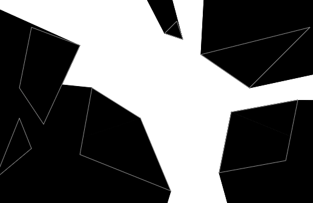

# shadowed
Dead simple shadow casting computation.

[](https://travis-ci.org/MD4/shadowed)
[](./LICENSE)
[](https://bundlephobia.com/result?p=shadowed)
[](https://bundlephobia.com/result?p=shadowed)



## Installation

This library is published in the NPM registry and can be installed using any compatible package manager.

```sh
npm install shadowed --save

# For Yarn, use the command below.
yarn add shadowed
```

### Installation from CDN

This module has an UMD bundle available through JSDelivr and Unpkg CDNs.

```html
<!-- For UNPKG use the code below. -->
<script src="https://unpkg.com/shadowed"></script>

<!-- For JSDelivr use the code below. -->
<script src="https://cdn.jsdelivr.net/npm/shadowed"></script>

<script>
  // UMD module is exposed through the "shadowed" global variable.
  console.log(shadowed);
</script>
```

## Documentation

[Documentation generated from source files by Typedoc](./docs/README.md).

## Demo

Checkout this repository then run:

```sh
npm run demo
```

## License

Released under [MIT License](./LICENSE).
